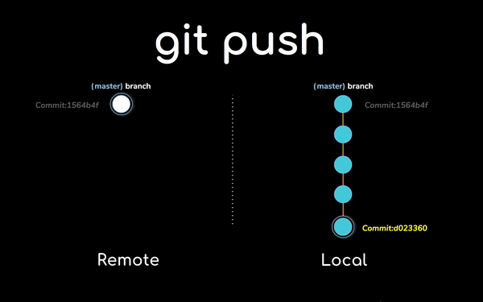

+++
title = "O que são branches e como elas funcionam"
description = "Tutorial para entender o que são branches e como elas funcionam"
type = ["posts","post"]
tags = [
    "branches",
    "github",
    "branching"
]

date = "2020-08-21"

categories = [
    "branching",
    "workflow",
]

series = ["Tutoriais"]

[ author ]
  name = "Beatriz Franco"
+++


## Branches: navegando entre diferentes ramos de trabalho  

Que bom te ver por aqui! Até este momento aprendemos sobre como contribuir para projetos abertos utilizando o git por meio da branch master. Ok, mas o que é branch master? Explicamos. 

Branch significa ramo de trabalho e a branch master é o ramo principal. No post [*Como contribuir com projetos abertos*](/posts/2020/08/como-contribuir-com-projetos-abertos/) aprendemos a fazer um fork de um projeto para o nosso repositório do GitHub e depois a cloná-lo (do repositório) para um diretório local da nossa máquina. Uma vez clonado o projeto, podemos incluir alterações sem interferir no código original (aquele que está no repositório em que fizemos o fork). 

Em um primeiro contato com o git, nossas primeiras contribuições foram feitas no ramo principal, na branch master do repositório local. No entanto, quando trabalhamos em um projeto, geralmente atuamos em diferentes partes. Submeter um *pull request* com alterações diversas não é recomendado. Além disso, nosso ramo principal de trabalho precisa se manter coerente e estável. Por isso, chegou a hora de aprender a usar outras branches além da master.

Pode soar complexo, mas a verdade é que fazer operações em branches separadas nos ajuda a melhor organizar o fluxo de trabalho. Para cada alteração desejada é recomendado criar uma nova branch. 

A título de exemplo, vamos supor que queremos criar um novo post no site do Pascalina sobre um tema qualquer, qual seja, "como usar o GitHub". Vamos fazer isso pasito a pasito logo abaixo:

1. No seu terminal, certifique-se de que você está no diretório do seu projeto usando o comando `pwd`.

Para verificar quantos ramos de trabalho existem e em qual você está basta digitar:

```bash
git branch -a
```

Se você ainda não criou nenhuma branch, você só terá a branch master, como mostrado abaixo: 


2. Para criar uma nova branch, digite:

```bash
git branch nome_da_branch
``` 

O ideal é que você nomeie a branch de forma que remeta à ação que está sendo realizada. Considerando o exemplo proposto aqui do nosso novo post sobre "como usar o GitHub", poderíamos nomear a branch de tutorial_github. 

Para listar as branches disponíveis, utilizaremos mais uma vez o comando `git branch -a`. Aqui o "-a" significa "all". O que você está dizendo então é: git me mostre todas as branches disponíveis.

Além de visualizar todas as branches, o terminal indica a branch na qual você se encontra sinalizando-a em verde e com um asterisco ao lado, como no print abaixo:


Apesar de criar uma nova branch, como você pode ver, ainda estamos na branch master. Para entrar na nova branch:

```bash
git checkout nome_da_branch
```

Quando criamos uma branch, o que acontece é que uma cópia do projeto é criada nesse novo ramo de trabalho, levando em consideração o último commit feito na branch anterior (onde você estava quando usou o comando `git branch nome_da_branch`). Suas alterações subsequentes ficarão armazenadas somente na branch em que você está trabalhando. 


No caso da imagem acima, trocamos para o ramo new_branch onde iremos então escrever o novo post. 

3. Tendo finalizado o trabalho, você deve subir a branch recém-criada para o seu repositório remoto no GitHub, apelidado convencionalmente de *origin*:

```bash
git push origin nome_da_branch
```

O que você está dizendo aqui é: git empurre nome_da_branch que está no meu repositório local para o meu repositório remoto (no GitHub). Essa é a sintaxe padrão: git + ação que você quer fazer + o lugar de destino + o objeto que você quer enviar. 



4. Agora suas atualizações estão no seu repositório, mas você ainda precisa submetê-las para a autora do repositório original. Isso é feito na própria interface do GitHub, por meio do *pull request*. No post [*Como contribuir com projetos abertos*](/posts/2020/08/como-contribuir-com-projetos-abertos/) ensinamos como fazer isso. A diferença aqui é que ao invés de submeter um pedido de request da sua master para a master do projeto original, vamos submeter um pedido da sua branch para a master do repositório "dono" do projeto. 


5. Não esqueça de enviar uma mensagem explicando suas contribuições para a proprietária do projeto. Se ela esiver satisfeita será feito um *merge* das suas constribuições na branch master do repositório original.


Para terminar, vamos revisar algumas cositas más: 

* As branches servem para dinamizar e flexibilizar o fluxo de trabalho uma vez que a branch principal requer estabilidade e coerência. A estrutura de trabalho por meio de branches também permite que diferentes recursos sejam criados por múltiplos colaboradores ao mesmo tempo sem comprometer a master.

* Ao nomear uma branch, seja o mais descritiva possível para que outras colaboradoras acompanhem o que está sendo feito de forma rápida e prática.

* Para incorporar as branches na branch master, abra pull requests, sempre um para cada branch.

* O GitHub fornece guias [aqui](https://try.github.io/) e tutoriais interativos sobre git [aqui](https://learngitbranching.js.org).  

* Não se preocupe em memorizar todos os comandos utilizados no terminal. Quando tiver dúvidas, você pode pedir ajuda no próprio terminal utilizando a sintaxe: git + ação que deseja realizar + --help, por exemplo:

```bash
git branch --help
```
